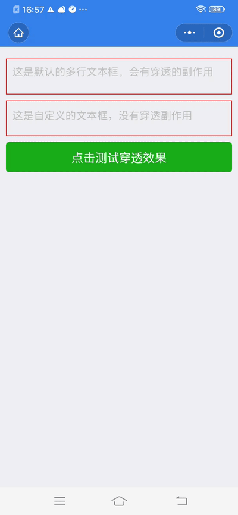
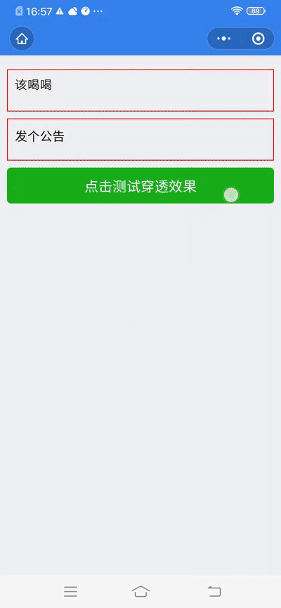

# 小程序自定义textarea组件

小程序原生的textarea组件存在以下问题：

+ 层级高，会覆盖掉定位为fixed的元素
+ 当页面滚动时，textarea组件会跟随页面滚动


该小程序自定义teaxarea组件旨在解决以上问题，使用方法为：

## 一、使用方法

1. clone该项目，将textarea文件夹拷贝至项目组件目录
2. 在页面配置中引入组件
3. 代码如下：

```json
{
  "usingComponents": {
    "multiline": "/components/textarea/index"
  }
}
```

```html
<multiline 
    wrap-class="wrap"
    textarea-class="textarea"
    placeholder-class="placeholder"
    placeholder="这是自定义的文本框，滚动不错位" 
/>
```

效果如下：





二、 属性与事件

组件支持原生组件的所有属性以及方法，除此之外支持以下属性：

+ `textarea-style`: 聚焦时textarea的自定义样式,
+ `virtual-textarea-style`: 失去焦点时textarea的自定义样式,
+ `textarea-class`: textarea组件自定义类名，同时作用于聚焦和失去焦点
+ `wrap-class`: 外层容器自定义类名

> 使用自定义组件时请注意样式与组件原有的样式优先级未定义

## 如果觉得对你有帮助，感谢给个star，如有问题，欢迎反馈，欢迎fork！
